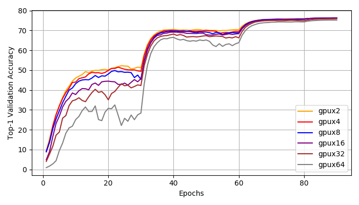
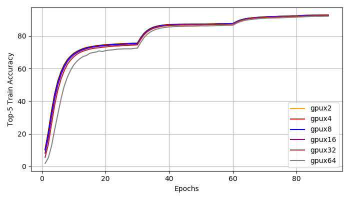
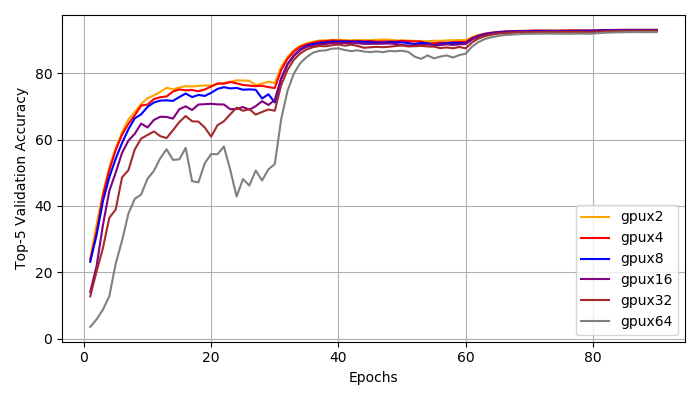
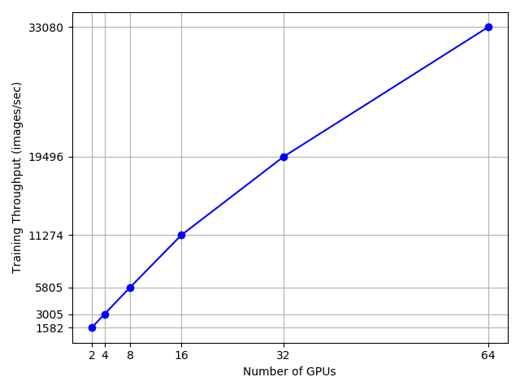
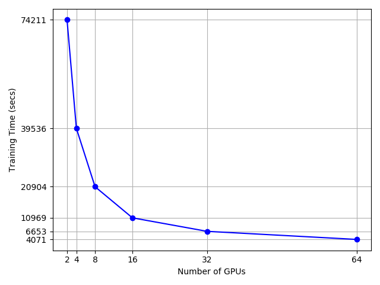

# Distributed training with PyTorch

## Overview

We will focus on: 
- distributed mixed precision training with NVIDIA `Apex`

We will cover the following training methods for PyTorch:
- regular, single node, single GPU training
- `torch.nn.DataParallel`
- `torch.nn.DistributedDataParallel`
- distributed mixed precision training with NVIDIA `Apex`
- `TensorBoard` logging under distributed training context

We will cover the following use cases:
- Single node single GPU training
- Single node multi-GPU training
- Multi-node multi-GPU training

## Results, Learning Curves, Visualizations

### Learning Curves

 



 



### Scalability Analysis


    


### I/O Performance


- Please see `RESULTS.md` for more details

## Requirements

- Python 3
- CUDA >= 9.0
- Install PyTorch ([pytorch.org](http://pytorch.org)) with GPU, version >= 1.0
- Download the ImageNet dataset and move validation images to labeled subfolders
    - To do this, you can use the following script: https://raw.githubusercontent.com/soumith/imagenetloader.torch/master/valprep.sh
    - on HAL cluster, use `/home/shared/imagenet/raw/`
- Install NVIDIA `Apex`
    ```
    $ git clone https://github.com/NVIDIA/apex
    $ cd apex
    $ pip install -v --no-cache-dir --global-option="--cpp_ext" --global-option="--cuda_ext" ./
    ```

## FP16 and FP32 mixed precision distributed training with NVIDIA `Apex` (Recommended)

References:

- mnist apex: https://github.com/yangkky/distributed_tutorial/blob/master/src/mnist-mixed.py
- apex examples: https://github.com/nvidia/apex/tree/master/examples
- apex tutorial: https://devblogs.nvidia.com/apex-pytorch-easy-mixed-precision-training/
- apex tutorial: https://developer.nvidia.com/automatic-mixed-precision
- apex doc: https://docs.nvidia.com/deeplearning/sdk/mixed-precision-training/index.html

Mixed precision training: majority of the network uses FP16 arithmetic, while automatically casting potentially unstable operations to FP32.

Key points:
- Ensuring that weight updates are carried out in FP32.
- Loss scaling to prevent underflowing gradients.
- A few operations (e.g. large reductions) left in FP32.
- Everything else (the majority of the network) executed in FP16.

Advantages:
- reducing memory storage/bandwidth demands by 2x
- use larger batch sizes
- take advantage of NVIDIA Tensor Cores for matrix multiplications and convolutions
- don't need to explicitly convert your model, or the input data, to half().

**`imagenet_ddp_mixprec.py` is deprecated. Use `imagenet_ddp_apex.py`.**

### Single node, multiple GPUs:

```bash
python -m torch.distributed.launch --nproc_per_node=4 imagenet_ddp_apex.py -a resnet50 --b 208 --workers 20 --opt-level O2 /home/shared/imagenet/raw/
```

### Multiple nodes, multiple GPUs:

To run your programe on 2 nodes with 4 GPU each, you will need to open 2 terminals and run slightly different command on each node.

Node 0:
```bash
python -m torch.distributed.launch --nproc_per_node=4 --nnodes=2 --node_rank=0 --master_addr="192.168.100.11" --master_port=8888 imagenet_ddp_apex.py -a resnet50 --b 208 --workers 20 --opt-level O2 /home/shared/imagenet/raw/
```

- torch distributed launch module: https://github.com/pytorch/pytorch/blob/master/torch/distributed/launch.py
- `--nproc_per_node`: number of GPUs on the current node, each process is bound to a single GPU
- `----node_rank`: rank of the current node, should be an int between `0` and `--world-size - 1`
- `--master_addr`: IP address for the master node of your choice. type `str`
- `--master_port`: open port number on the master node. type `int`. if you don't know, use `8888`
- `--workers`: # of data loading workers for the current node. this is different from the processes that run the programe on each GPU. the total # of processes = # of data loading workers + # of GPUs (one process to run each GPU)
- `-b`: per GPU batch size, for a 16 GB GPU, `224` is the max batch size. Need to be a multiple of 8 to make use of Tensor Cores. **If you are using tensorboard logging, you need to assign a slightly smaller batch size!**

Node 1:
```bash
python -m torch.distributed.launch --nproc_per_node=4 --nnodes=2 --node_rank=1 --master_addr="192.168.100.11" --master_port=8888 imagenet_ddp_apex.py -a resnet50 --b 208 --workers 20 --opt-level O2 /home/shared/imagenet/raw/
```

### FQA

1. The following message is normal behavior with dynamic loss scaling, and it usually happens in the first few iterations because Amp begins by trying a high loss scale.
```
Gradient overflow.  Skipping step, loss scaler 0 reducing loss scale to 4096.0Gradient overflow.
```

2. For multi-process training, even if you `ctrl C` on each compute node, there will still be some processes alive. To clean up all python processes on curr node, use:
```
pkill -9 python
```

## Non-distributed (ND) training

Use cases:
- Single node single GPU training

This is the most basic training method, no data parallel at all

```bash
python imagnet_nd.py -a resnet50 /home/shared/imagenet/raw/
```

The default learning rate schedule starts at 0.1 and decays by a factor of 10 every 30 epochs. This is appropriate for ResNet and models with batch normalization, but too high for AlexNet and VGG. Use 0.01 as the initial learning rate for AlexNet or VGG:

```bash
python imagnet_nd.py -a alexnet --lr 0.01 /home/shared/imagenet/raw/
```

## Single-processing Data Parallel (DP)

Use cases:
- Single node multi-GPU training

References:

- https://pytorch.org/tutorials/beginner/blitz/data_parallel_tutorial.html

`torch.nn.DataParallel` is easier to use (just wrap the model and run your training script). However, because it uses one process to compute the model weights and then distribute them to each GPU on the current node during each batch, networking quickly becomes a bottle-neck and GPU utilization is often very low. Furthermore, it requires that all the GPUs be on the same node and doesn’t work with `Apex` for mixed-precision training.

## Multi-processing Distributed Data Parallel (DDP)

Use cases:
- Single node multi-GPU training
- Multi-node multi-GPU training

References: 
- https://yangkky.github.io/2019/07/08/distributed-pytorch-tutorial.html
- https://github.com/yangkky/distributed_tutorial/blob/master/src/mnist-distributed.py
- https://github.com/pytorch/examples/blob/master/imagenet/main.py
- https://medium.com/intel-student-ambassadors/distributed-training-of-deep-learning-models-with-pytorch-1123fa538848
- http://www.telesens.co/2019/04/04/distributed-data-parallel-training-using-pytorch-on-aws/
- http://seba1511.net/dist_blog/

`torch.nn.DistributedDataParallel` is the recommeded way of doing distributed training in PyTorch. It is proven to be significantly faster than `torch.nn.DataParallel` for single-node multi-GPU data parallel training. `nccl` backend is currently the fastest and highly recommended backend to be used with distributed training and this applies to both single-node and multi-node distributed training.

Multiprocessing with DistributedDataParallel duplicates the model on each GPU on each compute node. The GPUs can all be on the same node or spread across multiple nodes. If you have 2 computer nodes with 4 GPUs each, you have a total of 8 model replicas. Each replica is controlled by one process and handles a portion of the input data.  Every process does identical tasks, and each process communicates with all the others. During the backwards pass, gradients from each node are averaged. Only gradients are passed between the processes/GPUs so that network communication is less of a bottleneck.

During training, each process loads its own minibatches from disk and passes them to its GPU. Each GPU does its own forward pass, and then the gradients are all-reduced across the GPUs. Gradients for each layer do not depend on previous layers, so the gradient all-reduce is calculated concurrently with the backwards pass to futher alleviate the networking bottleneck. At the end of the backwards pass, every node has the averaged gradients, ensuring that the model weights stay synchronized.

All this requires that the multiple processes, possibly on multiple nodes, are synchronized and communicate. Pytorch does this through its `distributed.init_process_group` function. This function needs to know where to find process 0 so that all the processes can sync up and the total number of processes to expect. Each individual process also needs to know the total number of processes as well as its rank within the processes and which GPU to use. It’s common to call the total number of processes the `world size`. Finally, each process needs to know which slice of the data to work on so that the batches are non-overlapping. Pytorch provides `nn.utils.data.DistributedSampler` to accomplish this.


### Single node, multiple GPUs:

```bash
python  imagenet_ddp.py -a resnet50 --dist-url 'tcp://MASTER_IP:MASTER_PORT' --dist-backend 'nccl' --world-size 1 --rank 0 --desired-acc 0.75 /home/shared/imagenet/raw/
```

### Multiple nodes, multiple GPUs:

To run your programe on 4 nodes with 4 GPU each, you will need to open 4 terminals and run slightly different command on each node.

Node 0:
```bash
python  imagenet_ddp.py -a resnet50 --dist-url 'tcp://MASTER_IP:MASTER_PORT' --dist-backend 'nccl' --world-size 4 --rank 0 --desired-acc 0.75 /home/shared/imagenet/raw/
```

- `MASTER_IP`: IP address for the master node of your choice
- `MASTER_PORT`: open port number on the master node. if you don't know, use `8888`
- `--world-size`: equals the # of compute nodes you are using
- `--rank`: rank of the current node, should be an int between `0` and `--world-size - 1`
- `--desired-acc`: desired accuracy to stop training
- `--workers`: # of data loading workers for the current node. this is different from the processes that run the programe on each GPU. the total # of processes = # of data loading workers + # of GPUs (one process to run each GPU)

Node 1:
```bash
python  imagenet_ddp.py -a resnet50 --dist-url 'tcp://MASTER_IP:MASTER_PORT' --dist-backend 'nccl' --world-size 4 --rank 1 --desired-acc 0.75 /home/shared/imagenet/raw/
```

Node 2:
```bash
python  imagenet_ddp.py -a resnet50 --dist-url 'tcp://MASTER_IP:MASTER_PORT' --dist-backend 'nccl' --world-size 4 --rank 2 --desired-acc 0.75 /home/shared/imagenet/raw/
```

Node 3:
```bash
python  imagenet_ddp.py -a resnet50 --dist-url 'tcp://MASTER_IP:MASTER_PORT' --dist-backend 'nccl' --world-size 4 --rank 3 --desired-acc 0.75 /home/shared/imagenet/raw/
```

## `TensorBoard`
`TensorBoard` is now a built-in module in PyTorch: `torch.utils.tensorboard`
- https://pytorch.org/docs/stable/tensorboard.html
- https://pytorch.org/tutorials/intermediate/tensorboard_tutorial.html?highlight=tensorboard
- https://www.tensorflow.org/tensorboard/get_started

## Distributed training with `Horovod`

References:

- https://docs.databricks.com/applications/deep-learning/distributed-training/mnist-pytorch.html
- https://horovod.readthedocs.io/en/latest/pytorch.html
- https://github.com/horovod/horovod/blob/master/docs/pytorch.rst

## Acknowledgment

Shout-out to all the references, blogs, code samples... used in this tutorial!
